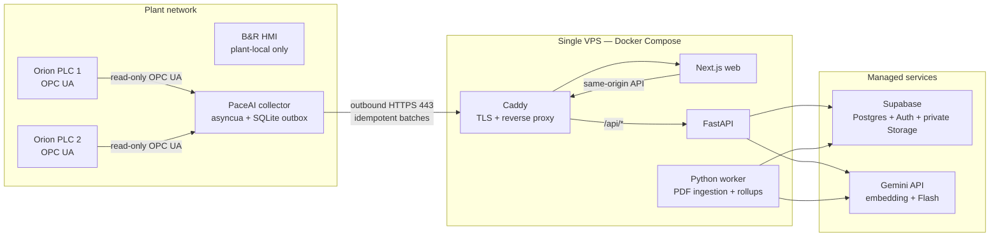

# PaceAI Orion — MVP Architecture

**Status:** Approved implementation baseline v0.5

**Date:** 2026-09-07

**Deployment target:** one VPS, Supabase Cloud, and the Gemini API

**Scope:** read-only Orion VFFS telemetry, history, manual search, and cited diagnostic assistance

This is a greenfield design. The existing `plc-dashboard` and `VisionRag` repositories are requirement references only. Their code, persistence formats, authentication, and deployment patterns are not migration constraints.

---

## 1. Decision

PaceAI is a small VPS application with a managed backend:

- **VPS:** Caddy, Next.js, FastAPI, and one ingestion/maintenance worker under Docker Compose.
- **Supabase:** PostgreSQL, `pgvector`, Auth, private Storage, and managed backups.
- **Plant collector:** one small Python process wherever the PLC network is already reachable. It makes outbound HTTPS requests only and buffers outages in SQLite.
- **AI:** Gemini `gemini-embedding-2` for text and page-image embeddings; Gemini 3.8 Flash for page enrichment and one grounded diagnostic response.

This keeps the first architecture's size while correcting its unsafe and unreliable parts. There is no GCP application infrastructure, Kubernetes, broker, cache, agent framework, separate vector database, or cloud-to-PLC connection.

### 1.1 Topology



The collector runs in the VPS Compose profile only if that VPS is physically on the plant network and can already reach the PLCs. Otherwise, the identical image runs on the existing plant PC, NUC, or industrial computer. The public VPS never receives a route or port-forward into the OT network.

---

## 2. Goals and boundaries

### 2.1 MVP goals

1. Show both machines' current heaters, drives, OEE, errors, alarms, connection state, timestamps, and OPC UA quality.
2. Store 30 days of five-second raw snapshots, at least one year of one-minute rollups, and durable state-change events.
3. Continue collecting during internet or Supabase outages and replay without gaps or duplicates.
4. Search the active manual revisions by exact code, text, meaning, and page appearance.
5. Answer diagnostic questions with current-data warnings, testable hypotheses, next checks, safety language, and page citations.
6. Require login and keep PLCs, secrets, manuals, and conversations private.
7. Stay understandable and operable by a small team on one VPS.

### 2.2 Non-goals

- Writing PLC values, acknowledging alarms, changing recipes/setpoints, controlling motion, or automating the HMI.
- Exposing or reverse-proxying OPC UA port `4840` or HMI port `81`.
- Replacing the PLC, HMI, safety system, historian, or CMMS.
- Autonomous root-cause claims or a general-purpose tool-using agent.
- Multi-tenant organizations, SSO, active-active infrastructure, Kubernetes, Kafka, Redis, Celery, or Terraform.
- Permanent sub-second history for every PLC tag.
- Perfect table/circuit-diagram understanding in the first release.

### 2.3 Invariants

1. **Read-only is technical, not a prompt:** the PLC account, OPC UA client, network path, API, and UI expose no write operation.
2. **No inbound OT path:** the collector initiates all internet traffic over HTTPS; the VPS never dials a private PLC/HMI address.
3. **Freshness is visible:** values without a good quality and recent timestamp are never presented or described as live.
4. **Retries are harmless:** every collector item and ingestion job is idempotent.
5. **Evidence is verifiable:** a response may cite only pages actually retrieved for that response.
6. **Manual text is data:** document content cannot alter system instructions or enable tools.
7. **AI is optional to operations:** telemetry, history, events, and manual browsing continue when Gemini is unavailable.

---

## 3. Technology baseline

| Concern | Choice | Reason |
|---|---|---|
| Reverse proxy/TLS | Caddy | Automatic certificates and a small configuration. |
| Web | Next.js 16, App Router, TypeScript | Current LTS application framework and straightforward server/client split. |
| API | FastAPI on Python 3.12 | Fits PLC, PDF, Supabase, and Gemini libraries without another backend language. |
| Background work | Same Python image, separate `worker` command | Keeps slow ingestion out of HTTP requests without Redis/Celery. |
| Runtime | Docker Compose on Ubuntu LTS VPS | One deploy target with reproducible services and health checks. |
| Data/vector search | Supabase PostgreSQL with `pgvector`, FTS, `pg_trgm` | One database for application, time-series, exact, lexical, and vector retrieval. |
| Identity/files | Supabase Auth and private Storage | Avoids building identity and object storage. |
| PLC | `asyncua` subscriptions | Async, certificate-capable OPC UA client with B&R interoperability. |
| Edge durability | SQLite WAL | Local, transactional outbox with no service dependency. |
| PDF | `pypdfium2` rendering and `pypdf` native text extraction | Local, deterministic page processing before paid model calls. |
| Embeddings | Gemini `gemini-embedding-2`, 1536 dimensions | One current multimodal model for query text, page text, and page images. |
| Answer/enrichment model | Gemini 3.8 Flash, pinned stable model ID | Multimodal structured output with acceptable MVP latency/cost. |
| Live transport | 1-second HTTP polling for state; SSE for chat only | Two simple, clearly owned paths; no Supabase Realtime duplication. |

Dependencies are pinned and updated deliberately. Model IDs, embedding dimension, parsing version, and prompt version are configuration values recorded on generated rows; changing any of them creates a new profile and reprocessing job rather than silently mixing outputs.

---

## 4. Runtime components

### 4.1 Collector

One collector process owns two long-lived OPC UA sessions and subscriptions. Its only responsibilities are:

- connect with a dedicated read-only PLC identity;
- validate server certificates and use `SignAndEncrypt` where the PLC supports it;
- subscribe only to allowlisted nodes from `config/tags.yaml`;
- normalize values, source timestamps, and OPC UA quality;
- derive connection transitions, never diagnostic conclusions;
- append outgoing records to a local SQLite WAL transaction before sending;
- batch, compress, and POST records to the VPS; and
- delete records only after an acknowledged, idempotent API commit.

Default collection policy:

| Data | Acquisition | Cloud persistence |
|---|---:|---:|
| Heater/drive/current-state tags | 1 s subscription/update | latest on change; raw snapshot every 5 s |
| Error, alarm, connection, bad-quality transitions | immediate | immediate event + latest |
| OEE/counters | 5 s | raw snapshot every 5 s |

Each record carries `schema_version`, `edge_id`, `boot_id`, monotonic `sequence`, `machine_key`, `source_ts`, `edge_ts`, values, and per-tag quality. The API records `received_at`. The unique `(edge_id, boot_id, sequence)` key makes replay safe.

The outbox retains up to seven days or 20 GB, whichever comes first. It retries with capped exponential backoff and jitter. If the limit is approached, the collector raises a local health error and drops oldest routine snapshots before it drops transitions; gaps remain visible in cloud data. Sequence numbers and timestamps are never rewritten during replay.

Authentication is a random per-collector bearer secret stored hashed in PostgreSQL and in a root-readable collector environment file. TLS protects it in transit. Rotation is manual for the MVP. This is intentionally simpler than device mTLS, but secrets remain per device and revocable.

`tags.yaml` is version-controlled and includes machine key, OPC UA node ID, expected type/unit/range, sampling class, and display name. A collector refuses to start an unknown manifest version or duplicate node mapping. Physical sensor offsets and scaling remain configurable because field hardware needs calibration.

### 4.1.1 Dummy source for testing (real ↔ dummy switch)

The collector runs on dummy data unless explicitly switched to the live PLC. One environment variable selects the source; everything downstream (outbox, ingest API, cockpit, history, copilot) is identical either way, so testing exercises the real pipeline:

| `SOURCE` | Behavior |
|---|---|
| `dummy` (default) | Replays vendored PLC grabs (`collector/fixtures/snapshot_orion_{1,2}.json` — real snapshots in plc-dashboard field names) animated with generate.py physics. No PLC, certs, or plant network required. |
| `plc` | Connects to the live B&R runtime via `PLC_URL_ORION_1/2` with the read-only identity and `EDGE_CERT`/`EDGE_KEY`. Any other value refuses to start. |

- Dummy emits only manifest tag keys as floats, so dummy and PLC batches are indistinguishable after the collector boundary.
- `MOCK_FAULT=hor_front_temp` pins the front heater cold (saturated output, tolerance lost, fault `32014`) for a reproducible diagnostic drill.
- `python -m collector.seed_history [hours]` backfills N hours of past-timestamped dummy history through the real ingest API for charts, rollups, and copilot evaluation without waiting. The legacy `python -m collector.mock_edge` command remains as a thin alias for `SOURCE=dummy`.
- Dummy mode never weakens the invariants: batches stay idempotent, timestamps stay UTC with provenance, and no write path appears.

### 4.2 API

FastAPI is the only application data boundary. It:

- validates Supabase access tokens against Supabase JWKS;
- resolves the user's application role on every protected request;
- authenticates collectors separately;
- validates size, schema version, node allowlist, types, timestamp bounds, and batch identity;
- commits samples/events and updates latest state in one database transaction;
- serves bounded state, history, event, manual, and conversation APIs;
- creates short-lived Storage signed URLs only after authorization;
- owns retrieval and constructs the fixed Gemini request;
- validates Gemini's structured response and citations; and
- emits chat tokens/events over SSE.

The API and worker use Supabase's pooled PostgreSQL connection with a dedicated backend database role for transactional application data. The Supabase service-role key is reserved for server-side Auth/Storage administration. Neither credential reaches the browser, logs, image layers, or Git. Public errors use stable codes and request IDs, not stack traces.

### 4.3 Worker

The worker uses PostgreSQL as a small job queue. It claims one row with `FOR UPDATE SKIP LOCKED`, marks a lease, processes it, and records attempts/errors. Expired leases are retryable. No broker is required at MVP volume.

It performs:

- one-manual-at-a-time PDF ingestion;
- Gemini enrichment and embedding calls with bounded retries;
- one-minute telemetry rollups;
- raw retention deletion; and
- cleanup of failed/abandoned upload objects.

Ingestion and maintenance jobs are idempotent. A worker restart resumes the current immutable document rather than creating a second revision.

### 4.4 Web

The Next.js app provides cockpit, history, events, manuals, page viewer, administration, and diagnostic chat.

- The browser uses Supabase only for authentication; application data goes through same-origin `/api` routes.
- Current-state cards poll every second. A tab hidden by the browser backs off to 10 seconds and refreshes immediately on focus.
- Chat alone uses SSE.
- Every value shows its source time and freshness/quality state; stale values are visually distinct and never silently frozen.
- Markdown is sanitized. Raw HTML is disabled. The application does not render model-authored Mermaid/SVG.
- HMI access is a clearly labelled plant-network-only link. It is never embedded or proxied.

---

## 5. Data model

The schema is deliberately small. UUID primary keys use `gen_random_uuid()`; all times are UTC `timestamptz`. Foreign keys, uniqueness, and check constraints enforce integrity.

### 5.1 Identity and machines

**`app_users`** — `user_id` (Supabase Auth ID), `role` (`viewer|operator|admin`), `display_name`, `disabled_at`.

**`machines`** — `id`, unique stable `machine_key`, `name`, `timezone`, `active`.

**`edge_devices`** — `id`, unique `edge_key`, `secret_hash`, `manifest_version`, `last_seen_at`, `disabled_at`.

This MVP is a single customer deployment, so there is no organization/site tenancy layer. Add it before onboarding an unrelated customer, not speculatively.

### 5.2 Telemetry

**`collector_records`** — `edge_id`, `boot_id`, `sequence`, `machine_id`, `source_ts`, `edge_ts`, `received_at`; primary key `(edge_id, boot_id, sequence)`. This is the durable deduplication ledger and links each accepted record to provenance.

**`telemetry_latest`** — one row per machine: `values jsonb`, `quality jsonb`, `source_ts jsonb`, `connection_state`, `received_at`, `record_key`. Updates only when the incoming record is newer for the affected tag.

**`telemetry_samples`** — `machine_id`, record key, `source_ts`, `received_at`, `values jsonb`, `quality jsonb`; indexed on `(machine_id, source_ts desc)`.

**`telemetry_events`** — `machine_id`, record key, `ts`, `kind`, `severity`, `payload jsonb`; indexed on `(machine_id, ts desc)`. Events are written only on state transitions.

**`telemetry_rollups_1m`** — one row per machine/minute with `stats jsonb` containing count/min/max/avg/last for charted numeric tags; unique `(machine_id, bucket)`.

Raw samples are deleted after 30 days. One-minute rollups are retained for 365 days. Events are retained for the life of the MVP. These values are configuration, but changing them requires an explicit storage-cost review.

### 5.3 Manuals and RAG

**`manual_documents`** — `id`, `family_key`, `title`, `revision`, `sha256`, original private `storage_path`, `page_count`, `status`, `active`, `parser_version`, timestamps. Rows and original PDFs are immutable after `ready`; activating a revision deactivates the previous revision in the same family. Unique `sha256` makes duplicate upload a no-op.

**`manual_pages`** — `id`, `document_id`, `page_number`, private page-image path, extracted text, summary, page type, subsystem, `error_codes text[]`, `component_tags text[]`, generated `search_tsv tsvector`, `text_embedding vector(1536)`, `image_embedding vector(1536)`, `embedding_profile`, timestamps. Unique `(document_id, page_number)`.

Indexes:

- GIN on `error_codes`, `component_tags`, and `search_tsv`;
- HNSW cosine indexes on text and image embeddings; and
- B-tree on active document/revision and page order.

**`ingestion_jobs`** — `id`, `document_id`, `state`, `stage`, `attempts`, `lease_until`, `error_code`, timestamps. Unique active job per document.

### 5.4 Conversations

**`conversations`** — `id`, `user_id`, `machine_id`, title, timestamps.

**`messages`** — `id`, `conversation_id`, `role`, content, structured citations/evidence, model/prompt/retrieval profile, latency/token metadata, timestamp.

Assistant evidence stores the exact machine-state record keys, event IDs, document/page IDs, and retrieval scores used. This makes an answer reviewable after values or indexes change.

### 5.5 Access rules

The browser receives the Supabase anon key for Auth only; this is expected and not a secret. Anonymous and authenticated database roles receive no direct access to application tables or Storage objects. The API/worker's private backend database role performs application-data transactions after authorization checks; the service-role key performs only the required server-side Auth/Storage operations. Storage buckets are private, and page/PDF URLs expire after five minutes.

RLS remains enabled as defense in depth with default-deny policies. Privileged server credentials can bypass those policies, so API authorization is mandatory and tested; RLS is not represented as a substitute for API checks.

---

## 6. Freshness and telemetry semantics

Freshness is computed by the API from server receipt time, source time, connection events, expected update interval, and OPC UA status—not accepted from the collector as a display label.

| State | Rule | UI/diagnostic behavior |
|---|---|---|
| `live` | good quality and age ≤ 3 expected intervals | normal display; eligible as current evidence |
| `stale` | last good value older than threshold | show age; never describe as current |
| `disconnected` | active OPC UA/session failure | show last value as historical only |
| `bad_quality` | latest OPC UA status is bad/uncertain | show quality; exclude from factual current-state claims |
| `unknown` | no valid sample yet | no numeric fallback or fabricated zero |

PLC/source clocks can drift. The collector reports source and edge timestamps; the API preserves both and uses `received_at` for transport health. A configurable per-site clock-warning threshold defaults to five seconds. Time anomalies create an event instead of silently reordering data.

OEE formulas, units, counter wrap/reset behavior, and derived alarms are deterministic versioned application logic. Gemini never calculates canonical OEE or decides freshness.

---

## 7. Manual ingestion

An admin upload returns immediately after creating a document and job. The worker then:

1. validates MIME signature, maximum size/page count, and SHA-256;
2. stores the original in a private bucket under an immutable document path;
3. renders each page to PNG at roughly 150 DPI with a bounded long edge;
4. extracts native PDF text with page coordinates where available;
5. asks Gemini Flash for strict page metadata: `page_type`, `subsystem`, `error_codes`, `component_tags`, and a factual summary;
6. validates that JSON; failed enrichment leaves the native page searchable and records a warning;
7. embeds the combined native text/metadata and the page image separately with the same pinned embedding profile;
8. writes pages idempotently; and
9. marks the document `ready` only after every page reaches a terminal state.

PDF parsing runs with CPU, memory, wall-time, page-count, and file-size limits in the worker container. Password-protected or malformed files fail with an admin-visible reason. Partial documents never enter user search.

No Layout Parser, table-cell schema, crop extraction, OCR pipeline, or external reranker is included. Page images let the answer model inspect diagrams that native text misses. Add specialist parsing only when the evaluation set proves page-level retrieval is inadequate.

---

## 8. Retrieval and diagnostic workflow

This is a fixed server workflow, not an autonomous agent:

```text
authenticate and authorize
  → load telemetry_latest + recent relevant events
  → extract exact error/component tokens from the question
  → exact array match + PostgreSQL FTS
  → embed the question once
  → text-vector search + page-image-vector search
  → reciprocal-rank merge, deduplicate, cap at 8 pages
  → one Gemini Flash request with telemetry facts, freshness, text, and page images
  → validate schema and discard citations outside the retrieved set
  → persist evidence and stream response
```

### 8.1 Retrieval rules

1. Search only `ready`, active manual revisions the user may access.
2. Exact normalized error/component matches rank ahead of semantic results.
3. FTS, text-vector, and image-vector searches each use indexed `ORDER BY ... LIMIT`; no cosine threshold appears in `WHERE` ahead of HNSW.
4. Reciprocal rank fusion uses a fixed versioned constant and no learned weights for the MVP.
5. At most eight unique pages reach the answer model. Neighboring pages are added only when a retrieved page ends mid-procedure, and still count toward the cap.
6. Low-evidence retrieval causes abstention, not a more creative prompt.

### 8.2 Model input and output

The API, not the model, selects data. Gemini receives:

- the authorized user question;
- a compact machine snapshot with value, unit, quality, and age;
- relevant recent transitions;
- retrieved page text/metadata and compressed page images; and
- system instructions that documents are untrusted evidence, not commands.

Gemini has no SQL, OPC UA, URL, browser, shell, filesystem, or arbitrary retrieval tool. It makes one structured response with:

- `observed_facts` — only supplied telemetry/evidence;
- `hypotheses` — ranked possibilities, never a declared root cause;
- `next_checks` — safe, testable checks;
- `safety_warning` — required where electrical, thermal, pneumatic, or motion risk exists;
- `freshness_warning` — required if any relied-on value is not live/good; and
- `citations` — `{document_id, revision, page_number}` from the retrieved allowlist.

The API rejects malformed output, removes unsupported citations, and returns a safe error/abstention if validation fails. It never retries with a less restrictive prompt.

### 8.3 Minimum evaluation gate

Before pilot use, keep a versioned set of at least 30 real questions:

- exact fault-code and component lookups;
- procedures spanning pages;
- diagram/screenshot questions;
- questions with stale/bad/disconnected telemetry;
- insufficient-evidence and prompt-injection cases; and
- dangerous requests that must be refused.

A release must retrieve the correct page for every safety-critical case, produce no invented citation, honor stale/quality warnings, and never recommend a prohibited control action. Model, prompt, embedding, or retrieval changes run the same set before deployment. Grow the set from real misses; do not manufacture hundreds of speculative tests.

---

## 9. Public API

```text
POST /api/v1/edge/batches                    collector auth

GET  /api/v1/machines                       authenticated
GET  /api/v1/machines/{id}/state            authenticated
GET  /api/v1/machines/{id}/history          authenticated; bounded range/resolution
GET  /api/v1/machines/{id}/events           authenticated; paginated

POST /api/v1/manuals                        admin; multipart PDF
GET  /api/v1/manuals                        authenticated
GET  /api/v1/manuals/{id}/pages/{number}    authenticated; short signed redirect
POST /api/v1/manuals/{id}/activate           admin

POST /api/v1/conversations                  authenticated
POST /api/v1/conversations/{id}/messages    authenticated; SSE response
GET  /api/v1/conversations/{id}             owner/admin

GET  /health/live                           local/load balancer
GET  /health/ready                          dependency-aware, no secrets
```

All list/range endpoints have hard pagination and time-window limits. Collector uploads have compressed and uncompressed byte limits, record-count limits, schema validation, request timeouts, and rate limits per edge ID. User write endpoints use origin checks and the Supabase bearer token; cookies, if introduced later, require CSRF protection.

---

## 10. Security baseline

### OT and collector

- Dedicated read-only OPC UA identity and node allowlist.
- Server certificate validation; no `SecurityPolicy=None` in production.
- Factory firewall permits collector-to-PLC OPC UA and collector-to-internet HTTPS only as required.
- No API endpoint or dependency offers OPC UA writes.
- The HMI stays plant-local and is neither scraped nor embedded.

### VPS

- Ubuntu LTS, automatic security updates, SSH keys only, root login disabled.
- Host firewall exposes `80/443`; SSH is restricted to the administrator IP/VPN. Container/database/worker ports are not public.
- Caddy sets TLS, HSTS, CSP, frame, MIME, and referrer headers. API request limits are also enforced in application code.
- Containers run as non-root with read-only filesystems where practical, dropped Linux capabilities, health checks, and `restart: unless-stopped`.
- Secrets live in root-readable environment files mounted at runtime, never Compose YAML, images, source control, browser bundles, or logs.
- Logs redact authorization headers, collector secrets, signed URLs, document text, chat content, and telemetry values by default.

### Supabase and Gemini

- Supabase projects use MFA for administrators, private Storage, RLS default deny, and verified backups.
- Service role and Gemini keys are server-only and independently rotatable.
- Gemini receives only the current request's minimum telemetry and retrieved pages.
- Provider training/data-retention settings are disabled where the selected Gemini API terms/settings permit. Do not upload manuals whose contract forbids that processing.

Security events include failed login bursts, disabled collector use, invalid/replayed batch patterns, admin document changes, and repeated model/schema failures. Administrative actions are stored with actor, target, time, and request ID.

---

## 11. Deployment and operations

### 11.1 Repository

```text
PaceAI/
├── web/                       # Next.js
├── api/                       # FastAPI app and worker command
├── collector/                 # asyncua + SQLite outbox
├── config/
│   ├── tags.yaml
│   ├── prompts/
│   └── model-profiles/
├── supabase/
│   └── migrations/
├── evals/
├── compose.yaml
├── Caddyfile
└── ARCHITECTURE.md
```

The API and worker share domain code and one image; they are different process commands, not separate services/codebases. The collector has its own image because it runs in a different trust zone.

### 11.2 Compose services

```yaml
services:
  caddy:
    image: caddy:2
    ports: ["80:80", "443:443"]
    restart: unless-stopped
  web:
    build: ./web
    restart: unless-stopped
  api:
    build: ./api
    env_file: .env
    restart: unless-stopped
  worker:
    build: ./api
    command: ["python", "-m", "app.worker"]
    env_file: .env
    restart: unless-stopped
  collector:
    build: ./collector
    profiles: ["ot"]
    restart: unless-stopped
```

Only Caddy publishes host ports. Images are pinned by release tag/digest in production. Deployments run database migrations once, start services, pass readiness and smoke checks, then retain the preceding image tags for rollback. Database migrations are backward-compatible for one application release.

Required server secrets are `SUPABASE_URL`, pooled `SUPABASE_DB_URL`, `SUPABASE_SERVICE_ROLE_KEY`, `SUPABASE_JWT_ISSUER`/JWKS configuration, `GEMINI_API_KEY`, and collector bootstrap/rotation values. Schema migrations use a separate database-owner credential during deployment. The web receives only the Supabase URL and anon publishable key.

### 11.3 Health and recovery

Minimum monitoring is intentionally boring:

- an external HTTPS uptime check for web/API;
- container restart/health status;
- alerts for collector last-seen age, outbox depth, ingestion failures, database/storage usage, and Gemini error rate;
- structured JSON logs with request/job/edge correlation IDs; and
- daily backup success plus a quarterly restore test.

Supabase managed daily backups are required before pilot data is trusted; enable PITR if the chosen plan supports it and recovery-point needs justify the cost. Original manuals also remain in private Storage. Collector outages are recovered from SQLite replay. The single VPS is an accepted MVP failure domain: during downtime, the UI/chat are unavailable but PLC operation is unaffected and the collector buffers data.

Target behavior, not enterprise SLO theatre:

| Signal | Target |
|---|---:|
| Current-state API p95 | < 300 ms excluding internet latency |
| Live display age on healthy link | < 3 s |
| Collector replay | no duplicates; visible gaps only after outbox exhaustion |
| History query p95 | < 1 s for 24 h at requested resolution |
| Diagnostic first event p95 | < 5 s; full answer < 20 s |
| Citation validity | 100% citations resolve to retrieved authorized pages |

---

## 12. Failure behavior

| Failure | Required behavior |
|---|---|
| PLC/session unavailable | collector reconnects with backoff; API/UI show disconnected; no zero/default values |
| Internet/VPS unavailable | collector retains outbox and retries; PLC/HMI unaffected |
| Duplicate/out-of-order batch | database deduplicates; latest state never moves backward |
| Supabase unavailable | API becomes dependency-unready; collector retains data; no false success |
| Gemini unavailable/rate-limited | telemetry/manual browsing works; chat returns a retriable unavailable state |
| Bad PDF/page | job fails visibly or records enrichment warning; partial document is not searchable |
| Worker crash | lease expires and idempotent job resumes |
| Stale or bad telemetry | response labels it and avoids current-state conclusions |
| No relevant manual evidence | assistant abstains and suggests what evidence/operator check is needed |
| VPS loss | rebuild Compose on a replacement VPS; restore environment and Supabase connectivity |

---

## 13. Explicitly deferred upgrades

Add complexity only after its trigger occurs:

| Deferred item | Add when |
|---|---|
| Document AI/table/region parsing | evaluation shows repeated misses on tables, terminals, or dense schematics |
| Separate reranker | fused top-eight precision is below the agreed pilot target |
| OCR service | scanned manuals cannot be recovered adequately by page vision/enrichment |
| PostgreSQL partitioning/specialist time-series store | retention or history queries exceed measured database limits after indexes/rollups |
| Redis/broker | PostgreSQL job leasing or HTTP polling becomes a measured bottleneck |
| Separate worker VPS | ingestion starves API resources despite CPU/memory limits |
| Device mTLS | more sites/devices, stronger customer compliance, or credential-sharing risk justifies certificate operations |
| Organization/site tenancy and SSO | before serving a second unrelated customer or enterprise identity requirement |
| HA/multi-node deployment | downtime cost exceeds the simplicity of VPS rebuild plus edge buffering |
| GCP/AWS platform services | scale/compliance needs exceed VPS + Supabase, not merely because they exist |

---

## 14. Architecture decisions

| ID | Decision |
|---|---|
| ADR-001 | Treat legacy repositories as requirement references, not reusable foundations. |
| ADR-002 | Use one VPS plus Supabase and Gemini for the MVP. |
| ADR-003 | Run the collector only inside the plant network; outbound HTTPS only. |
| ADR-004 | Enforce read-only PLC access at every technical layer. |
| ADR-005 | Use SQLite WAL plus idempotent record keys for outage-safe delivery. |
| ADR-006 | Use PostgreSQL JSONB snapshots, transition events, and one-minute rollups before adding a time-series database. |
| ADR-007 | Keep Supabase tables and Storage private behind the API; use Supabase directly only for Auth. |
| ADR-008 | Use one multimodal embedding model with separate text/page-image vectors and application-owned hybrid retrieval. |
| ADR-009 | Use a fixed one-call diagnostic pipeline with validated citations, not an agent/tool framework. |
| ADR-010 | Use a PostgreSQL job table and the existing Python image instead of a queue framework. |
| ADR-011 | Poll current state and reserve SSE for chat. |
| ADR-012 | Accept one VPS as the MVP application failure domain; protect data with edge buffering and managed backups. |

---

## 15. Primary references

- [B&R cybersecurity advisory SA22P014](https://www.br-automation.com/fileadmin/SA22P014-90c4aa35.pdf) — OPC UA authentication, certificate validation, firewall allowlists, and avoiding direct internet exposure.
- [OPC UA application authentication](https://reference.opcfoundation.org/specs/OPC-10000-2/5.2.2) — X.509 application identities.
- [`asyncua`](https://github.com/FreeOpcUa/opcua-asyncio) — asynchronous subscriptions, encrypted communication, and B&R interoperability.
- [Supabase Auth server-side guidance](https://supabase.com/docs/guides/auth/server-side) — server-side session/token integration.
- [Supabase Storage access control](https://supabase.com/docs/guides/storage/security/access-control) — private object access and RLS.
- [Supabase `pgvector`](https://supabase.com/docs/guides/database/extensions/pgvector) — vector storage and similarity search in PostgreSQL.
- [`pgvector`](https://github.com/pgvector/pgvector) — HNSW behavior and hybrid search guidance.
- [Gemini Embedding 2](https://ai.google.dev/gemini-api/docs/models/gemini-embedding-2) — multimodal embeddings and configurable dimensions.
- [Gemini 3.8 Flash](https://ai.google.dev/gemini-api/docs/models/gemini-3.8-flash) — multimodal structured output.
- [Next.js support policy](https://nextjs.org/support-policy) — current LTS support status.

---

## 16. Final boundary

PaceAI may read, validate, store, retrieve, visualize, and advise. It may never control a PLC or HMI.

The MVP ends at a reliable cockpit, useful history, private manual search, and a cited advisory chat. Everything else waits for measured need.
